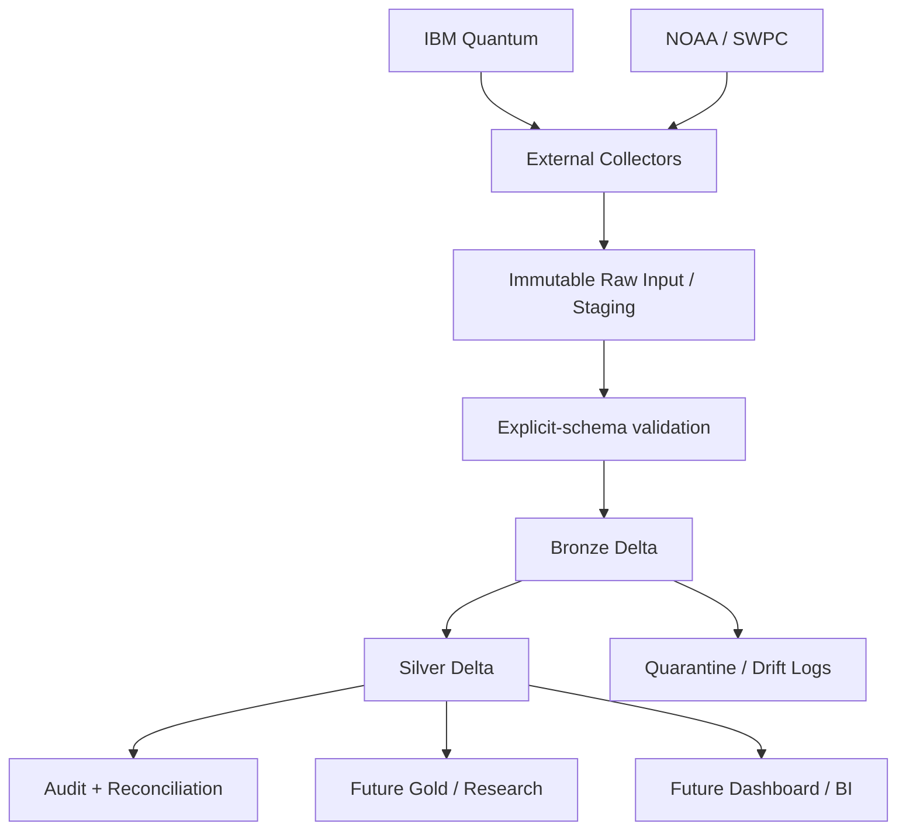

# Quantalytics

**Phase 2 Engineering Documentation — Bronze + Silver Foundation**

Quantalytics is a research-oriented data engineering project for longitudinal analysis of calibration reliability on real IBM quantum processors. The central research question is:

> Do real quantum processors exhibit predictable temporal and spatial reliability-drift patterns that are not visible from individual calibration snapshots?

Phase 2 does **not** attempt to prove that drift exists, build the final predictive model, or publish Gold-layer research results. Phase 2 builds the reproducible data foundation on which those later questions can be answered.

This README is the top-level implementation contract. Detailed contracts live in:

- `docs/architecture/phase2-architecture.md`
- `docs/data_contracts/bronze-silver-data-contract.md`
- `docs/operations/pipeline-runbook.md`
- `docs/testing/phase2-test-plan.md`
- `docs/research/phase2-to-gold-contract.md`
- `docs/decisions/architecture-decision-records.md`
- `docs/phase2/documentation-qa-report.md`

## 1. Status labels used in this documentation

| Label | Meaning |
|---|---|
| `REQUIRED` | Must be implemented for Phase 2 compliance. |
| `RECOMMENDED` | Strong implementation recommendation; may be changed only with documented rationale. |
| `ASSUMPTION` | Used because the supplied project material does not establish the fact completely. |
| `OPEN DECISION` | Cannot be safely finalized without new evidence or instructor/project-owner input. |
| `VALIDATION REQUIRED` | Must be confirmed against the actual frozen sample/source before coding is treated as final. |
| `IMPLEMENTATION NOTE` | Precision for coding agents; not a new research requirement. |

## 2. Phase 2 objective

`REQUIRED`

Build a robust, reproducible, parameterized, auditable Apache Spark pipeline that:

1. obtains approved IBM Quantum and NOAA/SWPC raw artifacts through an **external collector/staging boundary**;
2. preserves those artifacts immutably;
3. loads them into contract-enforced Bronze Delta tables using explicit schemas;
4. normalizes them into contract-enforced Silver Delta tables;
5. uses stable business keys and Delta `MERGE` for idempotency;
6. supports full load, incremental load, backfill, replay, and validation-only execution;
7. detects schema drift;
8. quarantines non-conforming records without silently discarding them;
9. writes operational audit metrics;
10. preserves the temporal, qubit, gate, backend, and environmental information required by future Gold/research work.

## 3. Scope

### 3.1 In scope

- external IBM and NOAA/SWPC collectors;
- immutable staged raw artifacts;
- explicit input schemas;
- IBM Bronze;
- NOAA Bronze;
- `silver_backend`;
- `silver_qubit_calibration`;
- `silver_gate_calibration`;
- `silver_environment`;
- stable key generation;
- strict casting;
- timestamp normalization to UTC;
- Delta merge semantics;
- watermark + overlap logic;
- quarantine;
- schema-drift logs;
- execution logs;
- reconciliation;
- idempotency tests;
- parameterized backfill/replay;
- development and academic-demonstration evidence.

### 3.2 Out of scope for Phase 2

- final QPU health score;
- final qubit ranking model;
- final drift-event thresholds;
- final calibration-staleness threshold;
- final prediction model;
- final causal interpretation of space weather;
- production-scale orchestration;
- production SLA/high-availability design;
- final Gold tables or dashboard implementation.

Those belong to Phase 3+ unless the academic requirements are changed.

## 4. Current platform verification

**Verified 2026-09-30 against current official vendor documentation.**

| Topic | Phase 2 position |
|---|---|
| Databricks | Use **Databricks Free Edition** for the no-cost student implementation unless the instructor mandates Azure. Legacy Community Edition was retired in 2025. |
| Free Edition compute | Free Edition provides serverless compute only and is quota-limited. |
| Network access | Free Edition outbound internet can be restricted to trusted domains; verified accounts can receive broader outbound access. The pipeline therefore must not depend on Spark notebooks calling IBM/NOAA directly. |
| IBM historical properties | IBM Quantum Compute REST exposes `GET /v1/backends/{id}/properties` with `updated_before` and `calibration_id`. |
| Qiskit convenience access | `IBMBackend.properties(refresh=False, datetime=None)` documents historical lookup semantics, but current IBM documentation states that specifying `datetime` can raise `NotImplementedError` in IBM Quantum Compute. |
| IBM property contents | Backend properties include qubit information such as T1/T2/readout error and gate information such as gate error and length. |
| Delta upsert | Delta Lake supports `MERGE` with explicit match conditions; duplicate source matches must be removed before merge to avoid ambiguous updates. |
| NOAA/SWPC | Current observational product files include `noaa-planetary-k-index.json` and `10cm-flux-30-day.json`. Their source observations are not pre-aligned to IBM calibration events. |

**Vendor-documentation basis:** Databricks Free Edition signup/limitations; Databricks serverless limitations; IBM Quantum Compute REST Backends API; IBM `IBMBackend` and `BackendProperties` API references; Delta Lake merge documentation; NOAA/SWPC products index and observational JSON products.

Time-sensitive vendor facts must be rechecked if implementation begins materially later than this documentation date.

## 5. Logical architecture



### Why collection is separated from Spark

`REQUIRED`

The external collector owns authentication, external HTTP calls, retries, rate-limit handling, and raw payload capture. Spark owns deterministic validation, Bronze persistence, normalization, Silver persistence, data quality, and audit.

This prevents Databricks networking limitations from becoming a correctness dependency and allows the same frozen raw inputs to be replayed without repeatedly calling external APIs.

## 6. Data sources

### 6.1 IBM Quantum

**Purpose:** obtain calibration/property history for configured real QPUs.

**Phase 1 targeted backends:**

```text
ibm_kingston
ibm_fez
ibm_marrakesh
```

`REQUIRED`: these names are **configuration values**, not architecture constants. Backend availability and entitlement must be checked at collection time.

**Historical baseline:** REST backend-properties retrieval using `updated_before`; `calibration_id` is used when a known calibration must be fetched exactly.

**Current snapshot convenience:** Qiskit may be used, but Phase 2 historical extraction must not depend exclusively on `backend.properties(datetime=...)`.

**Raw preservation:** save the exact returned JSON as a string or immutable file, calculate SHA-256, and store retrieval metadata separately.

### 6.2 NOAA / SWPC

Phase 1 requires at least:

- planetary Kp index;
- 10.7 cm solar radio flux.

Current observational products verified on 2026-09-30 expose:

- Kp observations with `time_tag`, `Kp`, `a_running`, `station_count`;
- 10.7 cm flux observations with `time_tag`, `flux`.

`REQUIRED`: preserve the source cadence. Do **not** join or aggregate NOAA observations to IBM calibration timestamps in Silver.

`IMPLEMENTATION NOTE`: `silver_environment` uses one row per observation type/time. This avoids fabricating temporal alignment between two products with different cadences.

## 7. Repository structure

```text
Quantalytics/
├── ingestion/
│   ├── ibm/
│   │   ├── collector.py
│   │   └── history.py
│   ├── noaa/
│   │   ├── collector.py
│   │   └── products.py
│   ├── common/
│   │   ├── http.py
│   │   ├── hashing.py
│   │   └── artifacts.py
│   └── README.md
├── spark/
│   ├── common/
│   │   ├── config.py
│   │   ├── keys.py
│   │   ├── merge.py
│   │   ├── audit.py
│   │   ├── quarantine.py
│   │   └── watermark.py
│   ├── bronze/
│   │   ├── ibm_bronze.py
│   │   └── noaa_bronze.py
│   ├── silver/
│   │   ├── backend.py
│   │   ├── qubit.py
│   │   ├── gate.py
│   │   └── environment.py
│   └── validation/
│       ├── schema_drift.py
│       ├── data_quality.py
│       └── reconciliation.py
├── notebooks/
│   ├── phase2/
│   │   ├── run_pipeline.py
│   │   └── demo_phase2.py
│   └── experiments/
├── schemas/
│   ├── bronze/
│   │   ├── ibm.py
│   │   └── noaa.py
│   └── silver/
│       ├── backend.py
│       ├── qubit.py
│       ├── gate.py
│       └── environment.py
├── config/
│   ├── defaults/
│   │   └── phase2.yaml
│   └── examples/
│       └── phase2.example.yaml
├── sample_data/
│   ├── full_load/
│   └── incremental_load/
├── tests/
│   ├── unit/
│   ├── integration/
│   ├── data_quality/
│   ├── idempotency/
│   └── fixtures/
├── research/
├── dashboard/
├── docs/
├── .github/
│   └── workflows/
├── requirements.txt
├── .gitignore
├── README.md
└── LICENSE
```

### Directory responsibilities

| Path | Responsibility |
|---|---|
| `ingestion/` | External source access and immutable artifact creation only. No Silver business logic. |
| `spark/common/` | Shared deterministic Spark behavior: configuration, keys, merge, logging, quarantine, watermark. |
| `spark/bronze/` | Explicit-schema raw artifact ingestion and immutable Bronze persistence. |
| `spark/silver/` | Source-to-analytical normalization with strict casts. |
| `spark/validation/` | Structural, value, uniqueness, referential, temporal, schema-drift, and reconciliation checks. |
| `schemas/` | Central executable `StructType` contracts. |
| `notebooks/phase2/` | Parameterized entry points and academic demonstrations. Not the home of core business logic. |
| `config/` | Non-secret environment and pipeline configuration. |
| `sample_data/` | Frozen, reproducible, non-secret full/incremental fixtures. |
| `tests/` | Unit, integration, DQ, idempotency, replay, failure and reconciliation tests. |
| `research/` | Phase 3+ research code; no final methodology is implemented in Phase 2. |
| `dashboard/` | Phase 3+ BI/dashboard work. |
| `docs/` | Architecture, contracts, runbook, tests, research contract, decisions, QA. |

## 7A. Prerequisites and environment setup

### 8.1 Prerequisites

`REQUIRED`

Before implementation/demonstration, provide:

- a GitHub repository for `HassanNawaz14/Quantalytics` or the instructor-approved repository;
- a Databricks Free Edition workspace, unless Azure is mandated;
- permission to create/use the configured catalog/schema/table or equivalent managed storage objects available in that workspace;
- a local/external Python environment for IBM/NOAA collection;
- IBM Quantum credentials/entitlement supplied through secrets, never committed;
- outbound internet access for the **external collector** runtime;
- frozen sample files for offline Spark development and academic demonstration;
- Git installed for local repository work;
- Python and package versions pinned in `requirements.txt` only after compatibility is verified with the chosen collector and Databricks runtime.

`VALIDATION REQUIRED`: do not invent a Python/Spark/Delta version in documentation. Pin exact versions after the selected Databricks environment and collector dependencies are initialized and verified.

### 8.2 Environment initialization

1. Clone or otherwise connect the GitHub repository to the development environment.
2. Create the configured Databricks catalog/schema or instructor-approved equivalent.
3. Create/identify controlled locations for:
   - staged immutable raw input;
   - Bronze;
   - Silver;
   - quarantine;
   - audit/drift/watermark tables.
4. Copy `config/examples/phase2.example.yaml` to an environment-specific non-secret config.
5. Inject source credentials through environment variables/secret facilities.
6. Install/pin only the dependencies actually required by the verified environment.
7. Run unit/schema tests before writing analytical tables.
8. Run `validation_only` against frozen sample files.
9. Only then execute the full-load golden path.

No environment setup step may require committing secrets.

## 8. Configuration contract

`REQUIRED`: business logic must not hard-code credentials, dates, backends, table names, paths, or research thresholds.

Recommended configuration file:

```yaml
environment: dev

databricks:
  catalog: "<catalog>"
  schema: "<schema>"
  bronze_location: "<volume-or-managed-location>"
  silver_location: "<volume-or-managed-location>"
  quarantine_location: "<volume-or-managed-location>"
  audit_location: "<volume-or-managed-location>"

input:
  root: "<staged-input-root>"

pipeline:
  run_mode: "incremental"
  source_system: "IBM"
  backend_list:
    - "ibm_kingston"
    - "ibm_fez"
    - "ibm_marrakesh"
  start_timestamp: null
  end_timestamp: null
  batch_id: null
  watermark_overlap_seconds: 86400
  allow_source_revision_update: false
  pipeline_version: "phase2-v1"
  schema_version: "phase2-v1"

sources:
  ibm:
    base_endpoint: "<configured externally>"
  noaa:
    kp_product: "<configured externally>"
    f107_product: "<configured externally>"

quality:
  allowed_clock_skew_seconds: 300
  fail_on_batch_contract_violation: true

logging:
  execution_log_table: "pipeline_execution_logs"
  schema_drift_log_table: "pipeline_schema_drift_logs"
  quarantine_table: "quarantine_records"
  watermark_table: "pipeline_watermarks"
```

`IMPLEMENTATION NOTE`: `86400` and `300` above are **examples**, not project constants. Production/default values must be confirmed and versioned in `config/defaults/phase2.yaml`.

Secrets are supplied through environment variables, repository secrets, or platform secret facilities and are never written into this YAML.

## 9. Collector artifact contract

Collectors emit immutable JSONL/envelope artifacts. One artifact record contains:

```json
{
  "source_system": "IBM",
  "source_artifact_id": "example-only",
  "source_uri": "logical-source-reference",
  "backend_id": "ibm_fez",
  "collection_timestamp": "2026-09-30T12:34:56Z",
  "raw_calibration_timestamp": "2026-09-30T00:00:00Z",
  "calibration_id": null,
  "observation_type": null,
  "raw_payload": "{...exact source JSON...}",
  "source_payload_hash": "<sha256>",
  "batch_id": "<uuid>",
  "collector_version": "phase2-v1"
}
```

This is an **example shape**, not an actual IBM response.

NOAA artifacts use the same envelope but populate `observation_type` and do not require `backend_id` or `raw_calibration_timestamp`.

## 10. Pipeline entry points

### 10.1 External collector CLI

The coding implementation must provide an interface equivalent to:

```bash
python -m ingestion.ibm.collector \
  --config config/defaults/phase2.yaml \
  --mode backfill \
  --backend ibm_fez \
  --start 2026-01-01T00:00:00Z \
  --end 2026-02-01T00:00:00Z \
  --batch-id <uuid>
```

```bash
python -m ingestion.noaa.collector \
  --config config/defaults/phase2.yaml \
  --mode incremental \
  --product all \
  --batch-id <uuid>
```

These examples define the intended parameter contract; exact shell packaging may differ if the repository uses an equivalent argument parser.

### 10.2 Spark/Databricks entry point

`notebooks/phase2/run_pipeline.py` must accept these parameters as Databricks widgets or equivalent runtime arguments:

| Parameter | Required | Meaning |
|---|---:|---|
| `run_mode` | yes | `full`, `incremental`, `backfill`, `replay`, `validation_only` |
| `source_system` | yes | `IBM`, `NOAA`, or `ALL` |
| `input_path` | yes | Staged immutable input file/folder |
| `batch_id` | yes except validation-only | Source collection batch identity |
| `run_id` | generated | Unique Spark execution identity |
| `backend_list` | conditional | Comma-separated/configured IBM backends |
| `start_timestamp` | backfill | Inclusive historical lower bound |
| `end_timestamp` | backfill | Exclusive/defined upper bound; document exact collector semantics |
| `watermark_override` | optional | Explicit operator override; logged |
| `allow_source_revision_update` | optional | Defaults false; controlled reconciliation only |
| `pipeline_version` | yes | Code/contract release identifier |

## 11. Execution modes

| Mode | Purpose | Writes analytical tables? | Watermark behavior | Idempotency requirement |
|---|---|---:|---|---|
| `full` | Establish baseline from supplied/frozen full-load artifacts. | yes | Initialize after successful commit. | Re-running same artifacts changes no logical rows. |
| `incremental` | Process candidate observations newer than or overlapping prior watermark. | yes | Advances only after successful commit. | Same artifact can be replayed with zero duplication. |
| `backfill` | Process arbitrary historical interval/files. | yes | Does not move normal incremental watermark by default. | Same range/files are safe to rerun. |
| `replay` | Reprocess an already captured immutable batch. | yes | No advance unless explicitly configured for recovery. | Deterministic result must match prior accepted result. |
| `validation_only` | Validate schema/DQ without changing Bronze/Silver. | no | Never changes watermark. | Side-effect free except validation/audit records. |

Full mode is included because the implementation prompt explicitly requires it even though the master specification primarily emphasizes incremental/backfill/replay/validation.

## 12. Bronze model summary

### `bronze_ibm_backend_properties`

Grain: one immutable IBM source payload version for one backend/calibration snapshot.

Stable identities:

- `snapshot_business_key = SHA256(backend_id | calibration_timestamp_utc)`
- `record_key = SHA256(snapshot_business_key | source_payload_hash)`

The merge key is `record_key`, not `load_timestamp`.

### `bronze_noaa_observation`

Grain: one immutable NOAA observation payload version for one source product/time/type.

Stable identities:

- `snapshot_business_key = SHA256(source | observation_type | observation_timestamp_utc)`
- `record_key = SHA256(snapshot_business_key | source_payload_hash)`

Bronze may contain multiple payload versions for the same snapshot business key. That is intentional preservation; a same-key/different-hash event is logged as a source revision/drift event rather than silently overwriting raw history.

## 13. Silver model summary

| Table | Grain | Business key |
|---|---|---|
| `silver_backend` | one backend at one calibration timestamp | `backend_id + calibration_timestamp` |
| `silver_qubit_calibration` | one physical qubit at one backend calibration timestamp | `backend_id + calibration_timestamp + qubit_id` |
| `silver_gate_calibration` | one 2-qubit instruction on an ordered qubit pair at one calibration timestamp | `backend_id + calibration_timestamp + gate_type + source_qubit + target_qubit` |
| `silver_environment` | one environmental observation type at one source observation timestamp | `source + observation_type + observation_timestamp` |

Full data dictionaries and explicit schemas are in `docs/data_contracts/bronze-silver-data-contract.md`.

## 14. Timestamp model

All persisted analytical timestamps are normalized to UTC.

These timestamps are different concepts:

| Timestamp | Meaning |
|---|---|
| `calibration_timestamp` | Source time at which IBM calibration/property state applies. |
| `collection_timestamp` | Time the external collector retrieved the payload. |
| `load_timestamp` | Time Spark materialized the Bronze/Silver record version. |
| `observation_timestamp` | NOAA observation time. |
| pipeline `start_time` / `end_time` | Operational run interval. |
| future analysis reference time | Gold-layer "now" used to compute calibration age. Not stored as mutable Silver state. |

`load_timestamp != calibration_timestamp`.

Identical reruns do not overwrite a historical scientific record just to change `load_timestamp`.

## 15. Idempotency model

### Bronze

- merge by immutable `record_key`;
- exact same payload/version => no-op;
- same snapshot business key with a different payload hash => retain the new raw version and log source revision;
- no duplicate `record_key`.

### Silver

Before `MERGE`, candidate rows are deduplicated to one row per Silver business key.

Default behavior:

```text
same business key + same source_payload_hash
    => unchanged

same business key + different source_payload_hash
    => SOURCE_REVISION_REQUIRES_REVIEW
       Bronze remains preserved
       candidate is quarantined/reconciled
       Silver scientific values are not silently overwritten

same business key + different payload hash
    + allow_source_revision_update=true
    + validations pass
    => controlled update + audit rows_updated += 1

business key not present
    => insert
```

This policy is deliberately conservative because the supplied project inputs do not establish an automatic source-revision precedence rule.

## 16. Watermark model

The normal incremental watermark is:

```text
max(source event/calibration timestamp successfully committed)
```

Discovery uses a configurable overlap:

```text
candidate_start = previous_watermark - configured_overlap
```

Candidates are then deduplicated by business identity and payload hash.

Rules:

1. read watermark before discovery;
2. include overlap;
3. process/validate/merge;
4. reconcile;
5. advance watermark only after the relevant target commit succeeds;
6. failed runs leave the watermark unchanged;
7. backfill/replay do not advance the normal watermark unless an explicit recovery procedure says otherwise.

## 17. Schema drift

| Drift | Default outcome |
|---|---|
| Additive field | Preserve in raw payload; log drift; Bronze continues; promotion to Silver requires schema-contract version change. |
| Safely parseable type representation | Normalize explicitly; log normalization; continue. |
| Incompatible type | Quarantine affected record; continue valid records if batch contract permits. |
| Missing required/breaking structure | Fail affected stage/batch safely; preserve raw artifact; do not mutate existing Silver; log precise drift event. |

Global blind auto-schema evolution is prohibited.

## 18. Audit and quarantine

Operational tables:

- `pipeline_execution_logs`
- `pipeline_schema_drift_logs`
- `quarantine_records`
- `pipeline_watermarks`

Audit includes run/batch identity, layer, stage, source, execution mode, parameters, start/end, status, row counts, watermark before/after, schema/pipeline version, DQ result and error details.

Quarantine retains the raw problematic record plus enough lineage to fix and replay it.

## 19. Data quality policy

Records/batches resolve to one of:

```text
accepted
accepted_with_warning
quarantined
rejected_batch
```

A single bad record does not automatically invalidate all valid records unless it violates a batch-level structural contract.

No arbitrary scientific "bad qubit" or drift threshold is introduced in Phase 2.

## 20. Testing

Local deterministic tests:

```bash
pytest -q tests/unit
pytest -q tests/data_quality
pytest -q tests/idempotency
pytest -q tests/integration
```

Databricks integration demonstrations must additionally execute the golden path in the runbook against frozen sample data.

Required test categories:

- unit;
- schema;
- integration;
- data quality;
- idempotency;
- incremental;
- backfill;
- replay;
- malformed input;
- schema drift;
- failure recovery;
- reconciliation.

## 21. Development order

Coding agents must follow this dependency order unless an architecture change is explicitly approved.

| Stage | Prerequisites | Work items / expected files | Dependencies | Tests | Output / acceptance |
|---|---|---|---|---|---|
| 1 — Repository & Environment | GitHub + Databricks/external Python access | repository tree, `requirements.txt`, `.gitignore`, config examples, secret contract | none | repository/config smoke tests | repo usable; secrets absent; dependencies documented |
| 2 — Raw Sample Validation | Stage 1 | freeze IBM/NOAA sample artifacts under `sample_data/`; document hashes/manifests | collector/source access or supplied samples | hash/shape checks | reproducible full/incremental fixtures |
| 3 — Explicit Schemas | Stage 2 | `schemas/bronze/*.py`, `schemas/silver/*.py`, source nested schemas | frozen sample shapes | schema unit tests | no inference path; samples parse or produce explicit drift |
| 4 — Bronze | Stage 3 | `spark/bronze/*`, keys/hash utilities, insert-only merge | schemas + staged input | raw→Bronze integration, Bronze idempotency | IBM/NOAA Bronze tables + lineage |
| 5 — Bronze Validation / Drift / Quarantine | Stage 4 | `spark/validation/schema_drift.py`, `data_quality.py`, `spark/common/quarantine.py` | Bronze + contracts | additive/type/breaking drift; malformed input | controlled accepted/quarantined/rejected outcomes |
| 6 — Silver | Stage 5 | backend/qubit/gate/environment normalizers and schemas | validated Bronze | Bronze→Silver integration, casts, units, keys | four Silver tables with stable grain |
| 7 — Audit / Reconciliation | Stage 6 | audit, drift log, reconciliation, watermark tables/modules | Bronze/Silver behavior stable | audit/reconciliation tests | queryable run evidence and accounted rows |
| 8 — Incremental / Backfill / Replay | Stage 7 | parameterized entrypoint, watermark overlap, all five modes | audit + stable merge logic | incremental/backfill/replay/validation-only tests | modes work without source-code edits |
| 9 — Testing | Stages 1–8 | complete `tests/` suite and fixtures | all modules | full Phase 2 suite | required tests pass |
| 10 — Demonstration Evidence | Stage 9 | `demo_phase2.py`/notebook outputs and captured evidence | passing tests | golden path | real evidence for full/incremental/rerun/backfill/drift/quarantine |
| 11 — Documentation Verification | Stage 10 | update README/contracts/runbook/ADRs from verified implementation | execution evidence | documentation QA | docs match implemented behavior; Phase 2 milestone can be tagged |


## 22. Troubleshooting quick reference

| Symptom | Expected action |
|---|---|
| External HTTP fails in Databricks | Do not redesign around notebook downloads. Run the external collector and stage the artifact. |
| Missing required source field | Preserve raw input; log schema drift; quarantine/reject according to contract; do not auto-add a Silver column. |
| Numeric cast returns null | Treat as measurable cast failure, not a valid null. Quarantine unless the field is legitimately optional and source value was truly null. |
| Duplicate Silver key before merge | Deduplicate deterministically or fail the candidate set; never allow ambiguous multi-match merge. |
| Same Silver key has different payload hash | Default to source-revision review, not silent overwrite. |
| Incremental rerun adds rows twice | Idempotency defect; fail acceptance. |
| Backfill changes newer data | Backfill/revision policy defect; restore from raw/replay and investigate. |
| Watermark moved after failed write | Operational defect; reset watermark from committed state and fix transaction ordering. |

## 23. Git and CI discipline

`REQUIRED`

- keep executable source, schemas, config examples, tests and documentation in GitHub;
- use meaningful commits; recommended prefixes are `feat:`, `fix:`, `docs:`, `test:`, `refactor:`, `data:`, `chore:`;
- use feature branches where practical for architecture/schema changes;
- do not commit credentials, token caches, local `.env` files or generated secrets;
- do not commit large raw/binary history unless explicitly required for the academic submission; keep reproducible compact samples instead;
- synchronize README/data contracts whenever a schema changes;
- identify/tag the verified Phase 2 milestone after the golden-path demonstration passes.

`RECOMMENDED`: GitHub Actions may run safe repository tasks such as Python syntax checks, unit tests, schema tests, linting, structure checks and secret scanning. The academic submission must **not** depend on fragile production-like deployment automation.

## 24. Security

`REQUIRED`

- never commit IBM/API credentials;
- never print tokens in logs;
- `.gitignore` excludes `.env`, local secret files, token caches and generated credentials;
- sample configuration contains placeholders;
- collectors strip/check authentication headers before persisting request metadata;
- raw payloads are reviewed for accidental credentials before public repository publication;
- public sample data must not include secrets;
- secret values are injected at runtime.

## 25. Resource control / FinOps

- perform one bounded historical baseline rather than repeated full downloads;
- persist immutable raw history outside Spark compute lifecycle;
- process candidate new files only;
- do not keep compute continuously active;
- use compact Delta/Parquet;
- avoid over-partitioning small tables;
- keep sample test datasets small;
- do not make the academic submission dependent on production-scale orchestration.

No physical partitioning is mandated at documentation time. The default for this small dataset is an unpartitioned/simple Delta table unless measured access patterns justify partitioning.

## 26. Coding Agent Handoff Contract

Coding agents must:

1. treat this generated documentation package as the Phase 2 development authority;
2. follow the documented architecture and layer boundaries;
3. implement the documented schemas and business keys;
4. use explicit Spark schemas and strict casts;
5. preserve immutable raw artifacts and lineage;
6. implement the documented failure/quarantine behavior;
7. implement all five execution modes;
8. implement and pass the documented tests;
9. follow the documented development order;
10. not invent alternate architecture silently;
11. not silently change schemas or keys;
12. not bypass validation for convenience;
13. not use `load_timestamp` as a business key;
14. not hard-code secrets or dates;
15. not introduce temporal leakage into later research features;
16. not turn association into causation;
17. raise a documented architecture change when a contract genuinely must change.

## 27. Phase 2 Definition of Done

### Architecture

- [ ] Databricks Free Edition or instructor-approved Azure environment initialized.
- [ ] Repository structure implemented.
- [ ] External collection boundary implemented.
- [ ] Dependencies pinned/documented.
- [ ] Configuration and secret-handling paths implemented.

### Bronze

- [ ] IBM Bronze implemented.
- [ ] NOAA Bronze implemented.
- [ ] Explicit input schemas used; no inference.
- [ ] Exact raw payload preserved.
- [ ] Payload SHA-256 stored.
- [ ] `load_timestamp` stored.
- [ ] `run_id` / `batch_id` lineage stored.
- [ ] Stable record identity stored.
- [ ] Duplicate raw reprocessing is a no-op.

### Silver

- [ ] `silver_backend` implemented.
- [ ] `silver_qubit_calibration` implemented.
- [ ] `silver_gate_calibration` implemented.
- [ ] `silver_environment` implemented.
- [ ] Strict casts and UTC timestamp normalization implemented.
- [ ] Stable business keys enforced.
- [ ] `load_timestamp` present.
- [ ] Invalid values handled by documented policy.
- [ ] Source revision policy enforced.

### Robustness

- [ ] Delta `MERGE` demonstrated.
- [ ] Full load works.
- [ ] Incremental mode works.
- [ ] Backfill works.
- [ ] Replay works.
- [ ] Validation-only mode is side-effect safe.
- [ ] Watermark + overlap works.
- [ ] Schema drift detected.
- [ ] Quarantine replay works.
- [ ] Failed runs do not corrupt Silver.
- [ ] Repeated input creates no logical duplicates.

### Logging / quality

- [ ] Execution log table exists.
- [ ] Schema drift log exists.
- [ ] Quarantine table exists.
- [ ] Watermark table exists.
- [ ] Insert/update/unchanged/quarantine counts logged.
- [ ] Start/end/status/parameters logged.
- [ ] Reconciliation is visible.
- [ ] Unit/integration/DQ/idempotency/backfill/replay/failure tests pass.

### Research readiness

- [ ] Backend identity preserved.
- [ ] Calibration/collection timestamps preserved.
- [ ] Qubit grain preserved.
- [ ] Gate endpoints/type preserved.
- [ ] T1/T2 and error measures preserved where source provides them.
- [ ] Environmental source timestamps preserved.
- [ ] No composite research score replaces raw Silver measures.
- [ ] Phase 3 contract accepted.

## 28. Requirement-to-implementation traceability matrix

| Official / project requirement | Implementation location |
|---|---|
| Databricks Community Edition or Azure requirement updated to current platform | README §4; Architecture §2 |
| GitHub version control | README §7 and §23; Architecture repository model |
| Bronze + Silver models | Data Contract §§3–10 |
| No Spark schema inference | Data Contract §4; explicit `StructType` code |
| Strict casting | Data Contract §11 |
| `load_timestamp` every Bronze/Silver record | Every Bronze/Silver schema |
| Idempotency | README §15; Data Contract §13; Test Plan idempotency tests |
| Delta `MERGE INTO` | Data Contract §13; Runbook merge workflow |
| Parameterized backfills | README §10–11; Runbook |
| Schema drift | README §17; Data Contract §12; Runbook |
| Dedicated logging | Data Contract operational tables; Runbook audit inspection |
| Audit metrics | `pipeline_execution_logs` contract |
| GitHub executable pipeline | Repository structure + Coding Agent Handoff |
| README models/execution | This README |
| Backfill guide | Runbook backfill section |
| Research preservation | Phase2-to-Gold contract |
| No causal leap from space weather | Phase2-to-Gold scientific guardrails |
| Future temporal prediction without leakage | Phase2-to-Gold prediction section |

## 29. Academic evidence / demo checklist

Capture evidence of behavior, not only source code:

1. repository tree;
2. explicit `StructType` definitions;
3. IBM/NOAA staged raw examples with secrets removed;
4. Bronze schemas;
5. Silver schemas;
6. successful full-load run;
7. successful incremental run;
8. incremental re-run with zero logical duplication;
9. successful arbitrary-date backfill;
10. same backfill re-run;
11. `MERGE` implementation and target row counts;
12. `pipeline_execution_logs`;
13. watermark before/after;
14. schema-drift event;
15. quarantined record;
16. replay of remediated quarantine;
17. source-to-Bronze-to-Silver lineage example;
18. reconciliation checks;
19. test summary;
20. README/runbook execution example.

Do not fabricate row counts or screenshots. Capture them only after the implementation executes.

## 30. Known assumptions, validations and open decisions

| Item | Status | Required action |
|---|---|---|
| Actual Phase 1 document was not separately supplied to this documentation-generation run; Phase 1 intent is taken from the master specification/prompt. | `ASSUMPTION` | If an original Phase 1 file is later supplied, compare it using the declared source-of-truth hierarchy. |
| Exact IBM response shape for the project account/backends. | `VALIDATION REQUIRED` | Freeze at least one real/sample payload per targeted backend before finalizing source-field adapters. |
| Whether the same IBM `last_update_date` can legitimately produce multiple distinct payload revisions. | `VALIDATION REQUIRED` | Validate against frozen history; Bronze already supports multiple hashes safely. |
| Automatic precedence for same-Silver-key source revisions. | `OPEN DECISION` | Default is no silent overwrite; owner must approve a deterministic revision rule before enabling updates. |
| Exact canonical single-qubit gate used for `single_gate_error` in qubit table. | `OPEN DECISION` | Configure after sample inspection; never pick arbitrarily. |
| `processor_family` reliable source mapping. | `VALIDATION REQUIRED` | Populate only from verified backend metadata; otherwise nullable. |
| Full physical coupling graph source | `OPEN DECISION` for Phase 3 | Phase 2 preserves calibrated gate endpoints; add separately versioned topology metadata later if required. |
| Default overlap-window size | `OPEN DECISION` | Keep configurable; choose from actual collection cadence/source revision behavior. |
| Physical table partitioning | `RECOMMENDED: none initially` | Introduce only if measured data volume/read patterns justify it. |

## 31. Explicit Phase 3 handoff contract

Phase 3 may rely on Phase 2 to provide:

- stable, unique backend/calibration identity;
- calibrated qubit-level temporal observations;
- calibrated two-qubit gate observations with ordered endpoints/type;
- source observation times for environmental series;
- immutable raw lineage;
- source payload hashes;
- deterministic replay;
- UTC timestamp semantics;
- no Gold-derived target leakage baked into Silver.

Phase 3 **must not** assume:

- that a particular drift magnitude exists;
- that a particular qubit/backend is "best";
- that a source revision was automatically scientifically correct;
- that Kp or solar flux causes QPU reliability change;
- that one arbitrary single-qubit instruction represents all 1Q performance;
- that Phase 2 Silver contains a complete static coupling graph unless a separate topology contract is later implemented.

The detailed research handoff is defined in `docs/research/phase2-to-gold-contract.md`.
