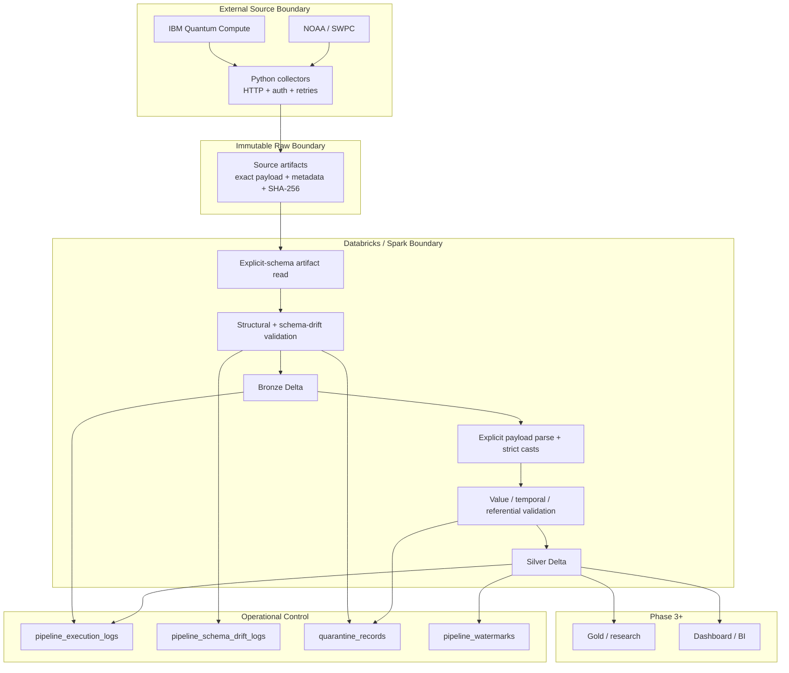
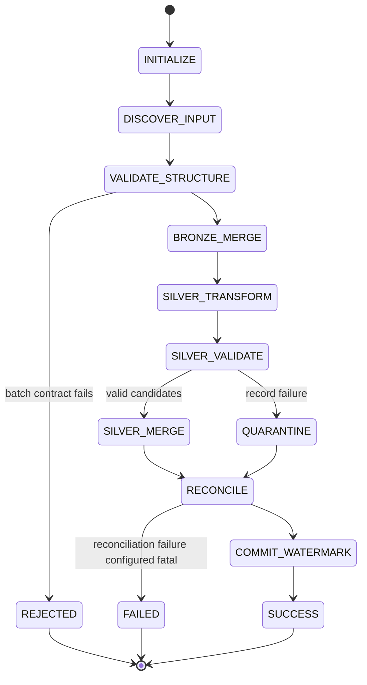

# Phase 2 Architecture

## 1. Purpose

This document specifies the Phase 2 system architecture for Quantalytics. It defines component boundaries, source-acquisition responsibilities, Spark responsibilities, data ownership, execution modes, replay, failure boundaries, security boundaries, lineage, and the contract presented to future Gold/research work.

Phase 2 is a small longitudinal telemetry lakehouse, not a one-off notebook.

## 2. Architectural drivers

### 2.1 Research driver

The system must preserve enough temporal and physical calibration detail to later study:

- stability of qubit rankings;
- spatial clustering of degraded qubits/gates;
- prediction of future poor-reliability states;
- calibration freshness;
- stale-selection loss;
- environmental association with QPU reliability.

The architecture must therefore retain source event times, qubit identity, gate endpoints/type, source lineage, and environment observation times.

### 2.2 Current platform driver

`REQUIRED`

Databricks Free Edition is the current no-cost student option. It is serverless-only and quota-limited. Outbound internet is restricted in the base experience, although verified accounts may receive broader outbound access.

Architectural consequence: **external HTTP collection is separated from Spark processing**.

### 2.3 Source API driver

IBM exposes backend properties through the Quantum Compute REST API with `updated_before` and `calibration_id`. Qiskit provides a convenient backend-properties interface but current IBM documentation allows `datetime` historical lookup to be unsupported in IBM Quantum Compute.

Architectural consequence: **the historical collector baseline is REST-based**. Qiskit may supplement but cannot be the sole historical mechanism.

## 3. Context diagram



## 4. Component contract

| Component | Owns | Consumes | Produces | Must not do |
|---|---|---|---|---|
| IBM collector | auth, REST requests, historical cursoring, retry/backoff, exact payload capture | IBM config + secrets + time/backend parameters | immutable IBM artifacts | Silver normalization/research scoring |
| NOAA collector | product download, cadence preservation, exact payload capture | NOAA product config | immutable NOAA artifacts | align NOAA to IBM calibration times |
| Immutable staging | source-of-record artifact storage | collector output | replayable files | mutate prior artifacts |
| Spark reader | explicit envelope schema | staged artifacts | typed candidate DataFrame | schema inference |
| Bronze transformer | timestamps, hashes/keys, provenance, immutable merge | typed candidates | Bronze Delta | research metrics |
| Schema validator | expected/observed structure comparison | candidate + contract | accepted/drift/quarantine outcome | auto-evolve silently |
| Silver normalizers | explode/normalize IBM/NOAA content, strict casting | Bronze | four Silver tables | invent missing source values |
| Data-quality engine | structural/value/temporal/referential/uniqueness checks | Bronze/Silver candidates | outcomes/metrics/quarantine | invent research thresholds |
| Merge engine | deterministic `MERGE` | deduplicated candidate sets | idempotent Delta state | merge ambiguous duplicate source keys |
| Watermark manager | last committed source-event watermark | successful run metadata | next discovery boundary | advance on failure |
| Audit logger | run/stage observability | pipeline events | execution log | print secrets |
| Quarantine | replayable invalid/conflicting records | failures/candidates | retained problem records | discard raw record |
| Drift logger | schema change events | validator | drift log | approve breaking changes automatically |

## 5. Data ownership and immutability

### 5.1 Collector artifact

The source artifact is the primary evidence of what was retrieved.

An artifact must contain or reference:

- exact source payload;
- source system;
- logical source URI/product;
- source artifact identifier;
- retrieval/collection time;
- calibration or observation time if available;
- backend/observation type when applicable;
- batch ID;
- payload SHA-256;
- collector version.

Artifacts are append-only/immutable.

### 5.2 Bronze

Bronze is an immutable-preservation table at the **payload-version** grain.

Bronze is allowed to contain two payload hashes for the same logical snapshot if the source actually changed. That is not a duplicate: it is a source revision/version event.

### 5.3 Silver

Silver is the normalized analytical state at stable business-key grain.

Silver is not an append-only payload archive. It is the current accepted normalized record for a defined source snapshot identity, with controlled revision semantics.

## 6. IBM collection architecture

### 6.1 Current snapshot mode

Collector may obtain a current backend property payload using an IBM-supported client/REST method. The collector writes the returned payload exactly and does not convert it into Silver fields.

### 6.2 Historical/backfill mode

Authoritative strategy:

```text
backend + end cursor
    -> request backend properties with updated_before
    -> persist returned payload
    -> extract returned last_update_date/calibration identity
    -> move cursor earlier
    -> continue until start boundary reached
```

`VALIDATION REQUIRED`: current IBM REST documentation confirms the `updated_before` filter, but the exact number/order of historical records returned per call and any pagination behavior must be validated against the live account/API before the crawler loop is finalized. The collector must not assume pagination semantics that are not observed/documented.

Rules:

1. `start_timestamp` and `end_timestamp` are explicit parameters.
2. Each successful response is persisted before advancing the cursor.
3. If `calibration_id` is known, it may be used for exact retrieval.
4. "No historical record" is a distinguished non-success outcome, not malformed data.
5. Authentication, permission, invalid backend and transient network failures are distinct error categories.
6. A later backend failure does not delete already persisted successful artifacts.
7. The collector returns a batch manifest describing successes/failures.

### 6.3 Backend configuration

Initial configured targets:

```text
ibm_kingston
ibm_fez
ibm_marrakesh
```

The collector accepts a list. It does not encode "three backends" into code.

### 6.4 IBM raw object model

The documented IBM backend-properties model contains:

- backend name;
- backend version;
- last update date;
- qubit property arrays;
- gate property arrays;
- general properties.

Qubit properties can include T1, T2, readout error and initialization error. Gate properties expose gate name/qubits plus parameter values including error/length where available.

No source field is guaranteed merely because a Phase 1 analytical column expects it. Absent optional source values remain null in Silver with quality metadata; they are not fabricated.

## 7. NOAA collection architecture

### 7.1 Products

Current observational files verified for Phase 2 use:

- planetary K-index observations;
- 10.7 cm solar radio flux observations.

Current observed record shapes include:

```text
Kp:
time_tag, Kp, a_running, station_count

F10.7:
time_tag, flux
```

`VALIDATION REQUIRED`: freeze representative source files at implementation start and version the source schemas; source services can evolve.

### 7.2 Cadence rule

NOAA observations are kept at source granularity. Kp and F10.7 are **not** forced into the same row by nearest-time matching in Phase 2.

Silver therefore uses `observation_type` and a sparse metric representation:

```text
source=NOAA_SWPC, observation_type=planetary_kp
    -> kp_index populated, solar_flux null

source=NOAA_SWPC, observation_type=f10_7_flux
    -> solar_flux populated, kp_index null
```

Phase 3 defines temporal alignment.

## 8. Spark processing architecture

### 8.1 Read

All raw collector-envelope files are read using explicit `StructType`. There is no `inferSchema`.

### 8.2 Structural validation

Before Bronze commit:

- required envelope columns present;
- expected source type;
- source payload not empty;
- hash syntactically valid;
- source event timestamp parseable when required;
- batch ID non-null;
- source-specific top-level schema fingerprint/keys checked.

Failure paths:

- missing batch-level structural fields -> reject affected batch/file;
- record-specific issue -> quarantine record if valid records can still be isolated;
- additive vendor fields -> retain raw payload and log drift.

### 8.3 Bronze write

1. normalize metadata timestamps to UTC;
2. recalculate payload hash and compare to supplied hash;
3. calculate snapshot business key;
4. calculate immutable record key;
5. deduplicate candidate `record_key`;
6. Delta merge using `record_key`;
7. write audit counts.

Bronze matched records are not updated.

### 8.4 Silver normalization

IBM Bronze creates:

- one backend-level record;
- one qubit row per physical qubit;
- one supported two-qubit gate/instruction row per ordered edge/type.

NOAA Bronze creates one environment row per observation type/time.

### 8.5 Silver merge

Each target has an explicit business key. Source candidates are deduplicated **before** merge.

A same-key/different-hash candidate is a source revision conflict by default. It does not silently overwrite scientific values.

## 9. Execution model



Validation-only branches after validation and writes only audit/drift/quarantine diagnostics explicitly allowed by the runbook; it never mutates Bronze/Silver/watermark.

## 10. Lineage

Canonical chain:

```text
source_system
  -> source_artifact_id / source_file_name
    -> source_payload_hash
      -> batch_id
        -> run_id
          -> bronze.record_key
            -> silver.record_key/business_key
```

Silver records carry:

- `batch_id`;
- `run_id`;
- `source_payload_hash`;
- `pipeline_version`;
- `schema_version`;
- `record_key`.

A researcher can trace a Silver record to the exact Bronze payload version and then to its immutable artifact.

## 11. Run identity

`batch_id` and `run_id` are different.

- `batch_id`: collector-side grouping of source artifacts.
- `run_id`: one Spark execution.

The same batch can be processed by multiple run IDs during replay/idempotency tests.

## 12. Failure boundaries

### 12.1 Collector failure

| Failure | Retry? | Preserve prior success? | Batch status |
|---|---:|---:|---|
| auth/permission | no until credential fixed | yes | failure/partial |
| rate limit | bounded retry/backoff | yes | success/partial/failure |
| transient network | bounded retry/backoff | yes | success/partial/failure |
| invalid backend | no | yes | partial/failure |
| malformed source response | bounded retry once if appropriate, then fail item | yes | partial/failure |
| no historical record | no error retry | yes | success with no record or documented gap |

### 12.2 Spark structural failure

No Bronze/Silver commit for an invalid batch-level contract. Raw remains available. Log failure and drift detail.

### 12.3 Record-level quality failure

Quarantine failing record, process valid records when safe, and mark audit `PARTIAL` or `SUCCESS_WITH_WARNINGS` according to runbook policy.

### 12.4 Silver source revision conflict

Bronze keeps the new version. Silver candidate is quarantined/reconciliation-blocked by default. Existing Silver remains unchanged.

### 12.5 Merge failure

Target must remain transactionally consistent. Watermark is not advanced. Raw/Bronze evidence remains for replay.

## 13. Replay model

Replay uses immutable raw artifact IDs or a prior `batch_id`.

Replay:

1. locates frozen artifacts;
2. creates a new `run_id`;
3. re-runs explicit-schema validation;
4. re-runs deterministic transformations;
5. applies normal idempotent merge behavior;
6. compares reconciliation/content hash to prior accepted result where available;
7. does not redownload external history.

Replay is a correctness feature, not merely an operational convenience.

## 14. Incremental watermark architecture

Watermarks are per logical stream, not a single global timestamp.

Recommended stream dimensions:

- IBM: `source_system=IBM`, `backend_id`;
- NOAA: `source_system=NOAA`, `observation_type`.

Watermark state:

```text
stream_id
watermark_timestamp
overlap_seconds
updated_run_id
updated_at
```

Incremental discovery begins before the stored watermark by the configured overlap. This protects against late/revised data.

## 15. Security boundary

Secrets exist only in the external collection runtime or approved secret manager.

The following must never be persisted in raw artifacts/audit:

- authorization header;
- API token;
- secret environment values;
- local credential file contents.

`source_uri` is a logical identifier and must not contain secret query parameters.

## 16. Repository architecture rationale

Core logic is implemented in modules under `ingestion/`, `spark/`, and `schemas/`. Notebooks are thin entry points.

This provides:

- unit-testable transformations;
- reusable merge/key logic;
- fewer hidden notebook dependencies;
- simpler coding-agent division of work;
- compatibility with local tests and Databricks demonstration.

## 17. Future Gold interface

Phase 3 receives stable Silver facts. Gold may derive:

- consecutive-calibration comparisons;
- drift percentages;
- calibration age;
- ranking;
- top-k turnover;
- stale-selection loss;
- spatial features;
- time-aware model features/targets;
- lag/window environmental features.

Gold may not require reinterpretation of raw vendor payloads for normal analysis.

## 18. Topology boundary

Phase 2 preserves:

- qubit IDs;
- two-qubit gate source/target;
- gate type;
- backend;
- calibration time.

`OPEN DECISION`: IBM calibration properties do not necessarily constitute a complete versioned coupling-map source. If Phase 3 requires the full hardware topology independent of observed gate calibration rows, acquire/version a separate topology metadata artifact. Do not hardcode topology into Bronze.

## 19. Resource strategy

The project is expected to be small. Optimize for correctness and maintainability:

- no always-on compute requirement;
- no mandatory streaming;
- bounded collectors;
- replay from staged raw;
- Delta tables without mandatory physical partitioning;
- partition only if measured read/write patterns justify it;
- compact test fixtures.

## 20. Architecture acceptance criteria

Architecture is accepted when:

- external collection and Spark boundaries are implemented;
- source artifacts are replayable and immutable;
- every Spark input uses explicit schema;
- Bronze/Silver keys match the data contract;
- repeated runs are idempotent;
- failed writes do not advance watermarks;
- source revisions do not silently overwrite Silver;
- operational logs provide enough evidence to reconstruct a run;
- Phase 3 can consume Silver without parsing raw vendor JSON for standard research variables.
